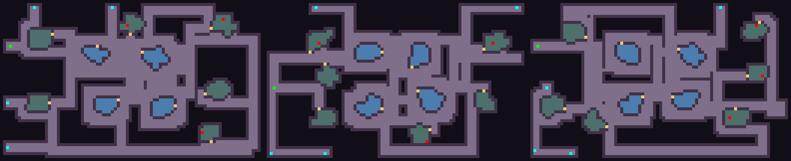
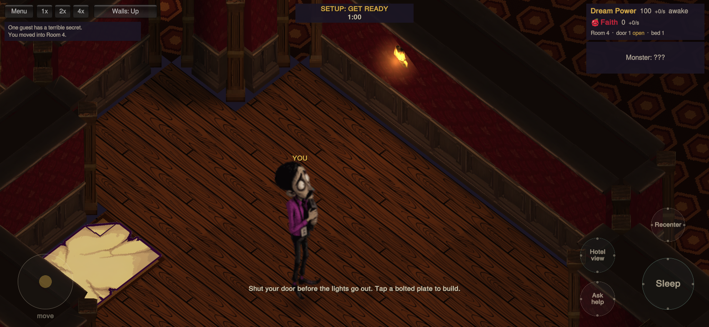

# Central rooms and lamp coverage — October 5, 2026

This records the earlier PR #4 iteration. The [single-perimeter QA](../single-walls-2026-10-05/README.md) supersedes its wall geometry and APK. The [earlier wall/control QA](../walls-2026-10-05/README.md) records the previous layout and APK; its route measurements describe that earlier generator.

## Layout

- Ten rooms retain the exact available-build-space budgets: 30, 26×3, 23×3 and 20×3, excluding the bed and access reservation.
- Four irregular rooms occupy the central area, each with corridors on all sides. The other six occupy the outer wings. The map remains 88×54.
- Routes reserve actual room outlines and door jambs. Accidental parallel double separators merge into corridor space without cutting an extra room entrance. Ordinary wall turns and end caps remain intact.
- A seeded 12% chance permits one peripheral pair to share a single wall; central rooms cannot join. The 100-seed test produced 11 joined maps. All 100 retained both nearby and isolated room choices, with the existing door-distance rules (minimum 7, nearest maximum 32, isolated above 8).

## Lighting

Room coverage targets at least 90% useful, subdued lamp light, leaving the remaining floor dim but readable. Corridor coverage targets at least 85%, with a darker ambient floor. These percentages measure floor coverage, not a brightness slider, and are minimum targets rather than exact bright/dim partitions.

The planner selects actual sconce mounting positions against the occluded light field. Every lamp pair is at least three tiles apart, including lamps on opposite faces and across room/corridor boundaries. Each room retains a full-height backdrop lamp in Cutaway. Bulbs have brighter emission and a soft amber halo anchored to the authored bulb mesh. Lowered walls, fog and local monster sight windows remove the associated halos.

The complete suite measured 23 hotel builds (22 distinct map seeds): every room met 90%; the lowest corridor coverage was 88.10%. Hotels used 54–70 lamps. [Coverage CSV](light-coverage.csv) records the results. Coverage uses four inset samples per floor tile at a useful-light threshold of 0.25, matching GPU bilinear sampling and including wall-edge shadows. Static illumination conservatively treats doors as opaque; opening a door does not rebake it.

## Validation and reproduction

- Unity 6000.3.24f1, complete EditMode suite: **110/110 passed**, no skipped tests. Includes 100 layouts, 20 complete rendered hotels, room build budgets, collision, wall states, visibility, manual combat, lighting coverage and GLES3 shader compilation.
- A final empty-glow fallback guard was followed by **6/6 focused renderer and GPU glow tests**, including another 20-hotel resource cleanup/coverage run. Both XML reports are included.
- **20 geometry captures** passed: ten scenarios each at 1560×720 and 960×720. Run `BadAppleHotel.EditorTools.WallCapture.Run` without `-quit`, setting `BADAPPLE_QA_WIDTH` and `BADAPPLE_QA_OUT`. Geometry fixtures use clairvoyance; hallway/walking fixtures retain ordinary fog, as recorded in each report.
- **Six normal-fog gameplay captures** passed: nearby/remote monsters, local three-cell wall windows, sleeping through an attack, and explicit Shoot availability. Run `BadAppleHotel.EditorTools.WallBehaviorCapture.Run` with `BADAPPLE_BEHAVIOR_OUT`. This run recorded no gameplay or editor startup errors.
- Maximum full-hotel wall draw submissions across the integration fixtures were **25**, including the single combined glow batch. Editor and software-emulator timings do not establish phone frame rate.

## Test APK

`BadAppleHotel.EditorTools.AndroidBuild.BuildTestApk` builds `Builds/BadAppleHotel-central-lamps.apk` (or `BADAPPLE_APK_PATH`). Version **1.5-central-lamps**, code **6**, IL2CPP ARM64/x86_64, OpenGLES3, release player with debug signing. Native engine stripping remains disabled to preserve the earlier startup fix. ZIP integrity passed; exact size and SHA-256 are in [apk.json](apk.json).

The exact APK passed an Android 11/API 30 x86_64 software-emulator smoke test: menu, resident setup and Night gameplay rendered; joystick, wall mode and 4× speed inputs were exercised. The match progressed through player death into spectator view. The captured [Unity/AndroidRuntime log](android-unity.log) contains no application exceptions or shader errors. A System UI busy dialog appeared during emulator startup; choosing Wait allowed it to recover. This is functional evidence, not phone performance data.

Physical Android frame-rate testing remains outstanding.
