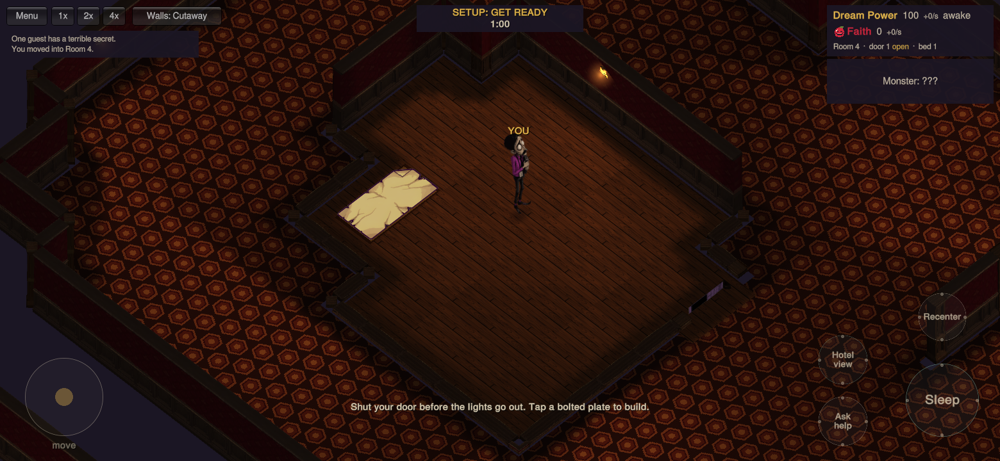
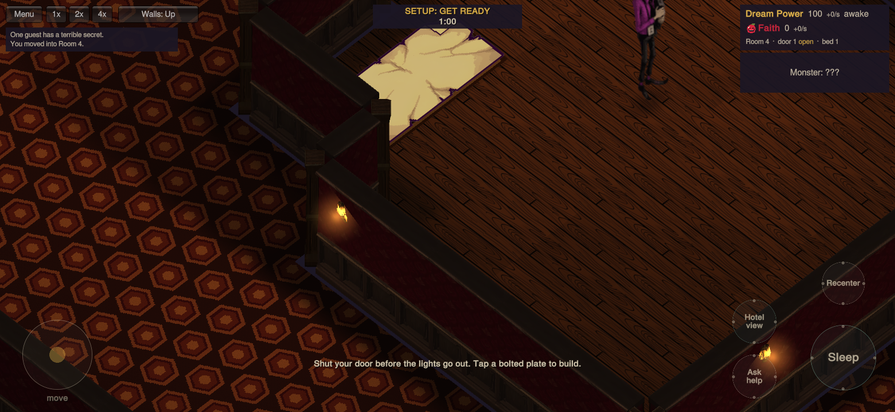

# Single room perimeters — October 5, 2026

This iteration supersedes the wall geometry in the [central-room and lamp QA](../central-lamps-2026-10-05/README.md). It keeps ten rooms, four central islands, the exact 30/26×3/23×3/20×3 build budgets, rare joined rooms, and the existing distance rules.

## Physical walls

Each room owns one perimeter. The corridor no longer generates a second enclosing outline around it, including at irregular stepped corners. Logical room/corridor boundaries map onto a shared centerline inside the reserved wall strip. Physical walls are 0.3 tiles thick, with one imported corner at each turn. Horizontal decorative faces point south and vertical faces west, toward the fixed camera. The full-cell backing blocks and opposing decorative skins have been removed.

Routing reserves diagonal room-corner cells as well as straight edge cells, so corridors cannot consume a corner and fragment the wall into short stubs.

Rendering and collision use the same thin footprints. Door ends remain outside the full one-tile opening so both residents and monsters fit. Diagonally touching floor regions join around the solid quadrants, preventing corner props from entering a corridor and blocking navigation. Floor margins use nonoverlapping subdivisions to avoid flickering at stepped walls. Movement retains its tangent when an actor reaches the logical floor edge, preventing diagonal path-following stalls.

Exterior walls start at full height. Occupied-room near walls lower together, while far walls stay up. A monster's local three-square peek retains a capped low base instead of cutting an empty hole. Glow halos obey the same peek and visibility state.

Corridor cleanup requires every corridor tile to belong to a complete 3×3 corridor patch, then checks connectivity and access to all ten doors. This removes narrow U-shaped hooks and tiny blind pockets without changing room floors or build budgets.

## Validation

- Complete Unity EditMode suite: **115/115 passed**, no skipped tests. [XML report](editmode-tests.xml) includes 100-layout checks, 300 navigation routes, exact build budgets, door clearance, physical wall ownership, room cutaways, monster sight, sleep/shoot controls, lamp coverage and GLES3 shader compilation.
- Twenty complete rendered hotels use the imported kit with no overlapping physical spans, no full-cell backing blocks, and matching thin collision footprints. The maximum full-hotel wall submission count is **15**, including the combined lamp glow batch.
- The full-suite lighting fixtures cover 23 hotel builds. All rooms meet 90% useful-light coverage; all corridors exceed 85%. Exact measurements are in [light-coverage.csv](light-coverage.csv). Lamps remain at least three tiles apart.
- **24 geometry captures** passed at 1560×720 and 960×720, including the central-room perimeter, south corner, outer boundary, both wall axes, doors and glow. **Six normal-fog gameplay captures** passed, including the three-square low-base peek.
- The exact APK's installed SHA-256 matches [apk.json](apk.json). Android 11/API 30 x86_64 software-emulator checks reached the menu and a playable resident match in Night 1, exercised the wall toggle and joystick, and rendered the HUD without a development overlay. See [android-gameplay.png](android-gameplay.png). The [runtime log](android-unity.log) contains no application exceptions or shader errors; the match also progressed into Night 2 and spectator view.

## Reproduction

Unity 6000.3.24f1. Geometry captures use `BadAppleHotel.EditorTools.WallCapture.Run` with `BADAPPLE_QA_OUT` and `BADAPPLE_QA_WIDTH` (1560 or 960), without `-quit`. Reports distinguish clairvoyance geometry fixtures from normal-fog hallway fixtures.

Gameplay captures use `BadAppleHotel.EditorTools.WallBehaviorCapture.Run` with `BADAPPLE_BEHAVIOR_OUT`. The six cases exercise near/remote monster visibility, the local three-square peek with a low base, sleeping through an attack, and manual Shoot availability.

`BadAppleHotel.EditorTools.AndroidBuild.BuildTestApk` builds the APK selected by `BADAPPLE_APK_PATH`. Version **1.6-single-walls**, code **7**, IL2CPP ARM64/x86_64, OpenGLES3, release player with debug signing. Native engine stripping remains disabled to preserve the startup fix.

Phone frame rate still requires a physical Android device; editor and software-emulator timings are not phone performance evidence.
